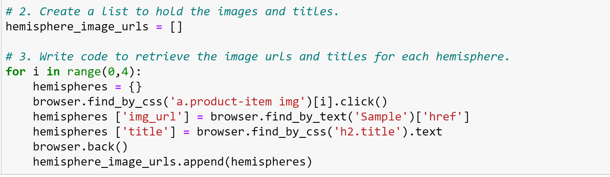
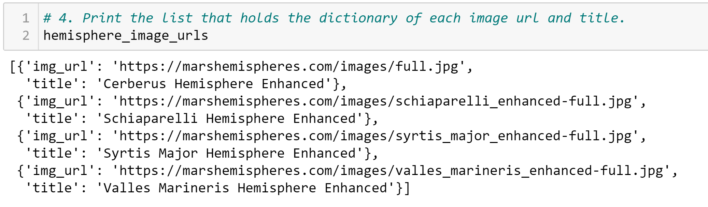
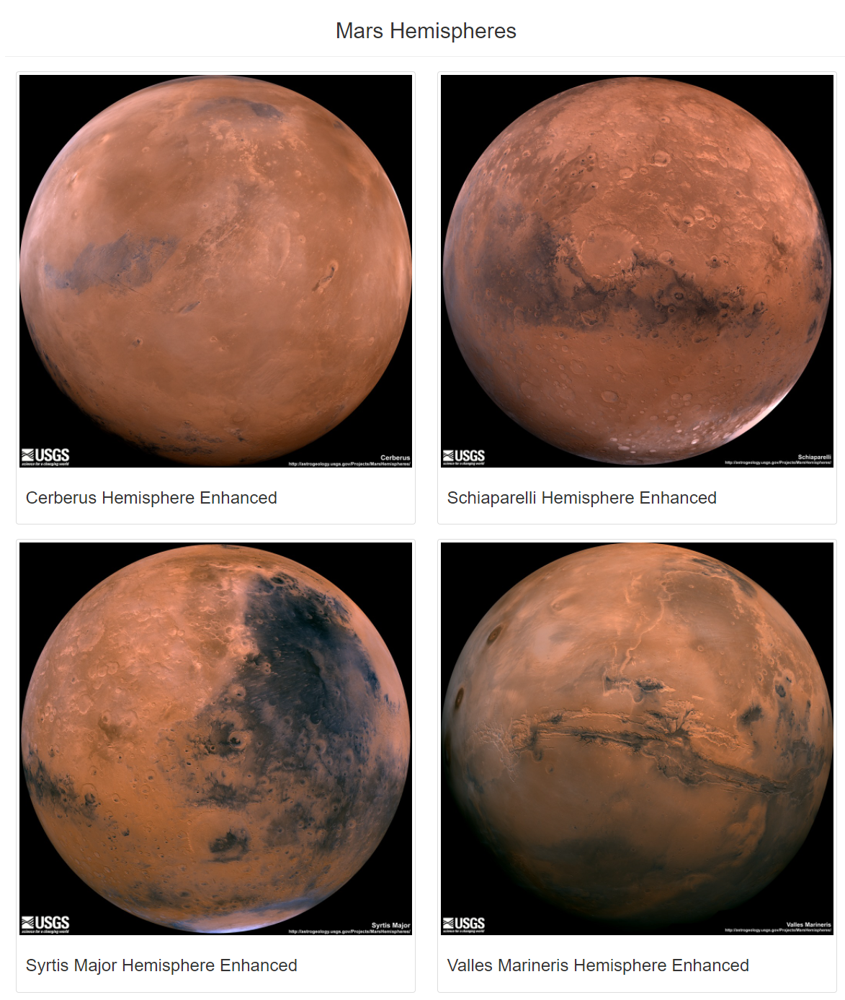
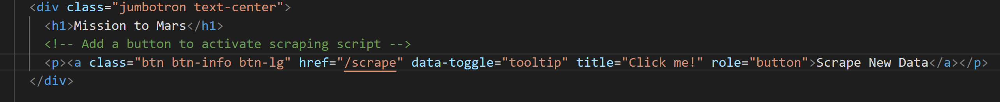
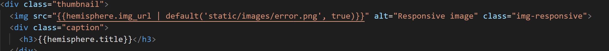

# Mission-to-Mars

Mission to Mars-Web Scraping with HTML/CSS

### Overview of Mission-to-Mars

The script we're building is designed to scrape the most recent data—that means that each time we run the script, we'll pull the newest data available. As long as the website continues to be updated with new articles, which is likely, we'll have a constant influx of new information at our fingertips. we're going to scrape the featured image from Mars website, Once the image is scraped, we'll want to add it to our web app as well which is done in Mission-to-Mars project.

we want to adjust the current web app **(Mission-to-Mars)** to include all four of the hemisphere images. To do this, we have to follow these steps:
1. use BeautifulSoup and Splinter to scrape full-resolution images of Mars’s hemispheres and the titles of those images
2. store the scraped data on a Mongo database
3. use a web application to display the data
4. Add Bootstrap 3 Components

### Results

we have to use the DevTools to inspect the page for the proper elements to scrape then we will need to retrieve the full-resolution image for each of Mars's hemispheres.we add the dictionary with the image URL string and the hemisphere image title to the list and then going to the next image URL and title. we did with this part of the code shown in the picture.

The results are shown in the below picture

Then we update Mongo database, and modify index.html file so the webpage contains all the information from Mission-to-Mars project as well as the full-resolution image and title for each hemisphere image. Four pictures and the results in mongo database shown in the picture below.

### Summary

Our web app is mobile-responsive, and we add two additional Bootstrap 3 components to make it stand out. 

- we changed the button primary class to info, which is green.
- Added a tooltip that says Click Me!, when the user hoovers over the Scrape button.
- Added **.img-responsive** class to make it responsive-friendly.

